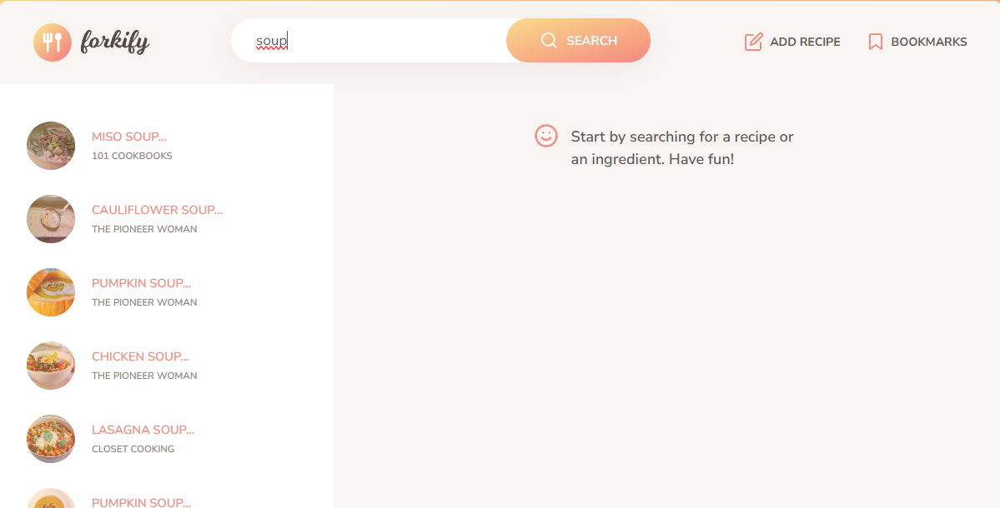
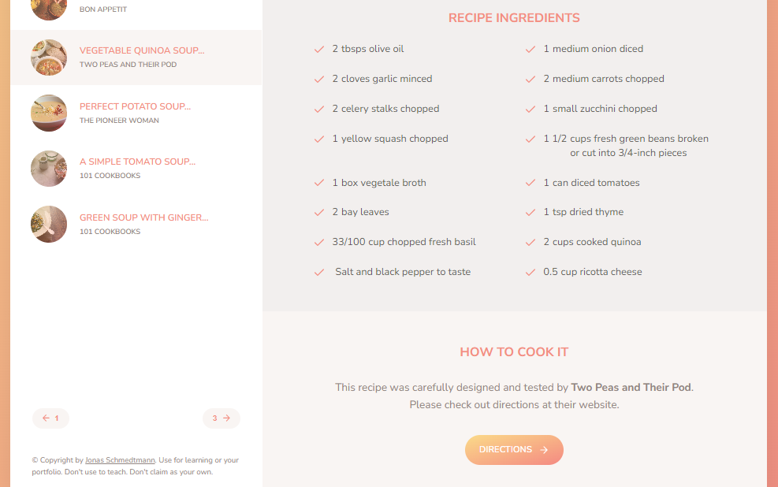
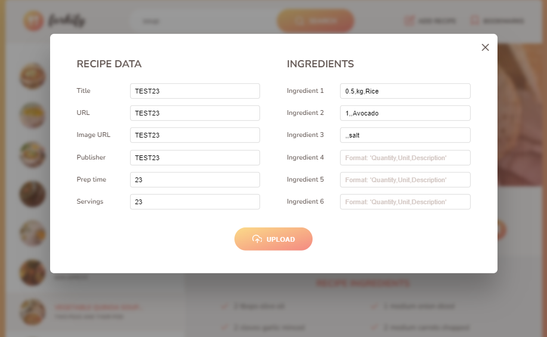

# <h1 align="center"> Forkify-App</h1>
## Jonas Schmedtmann eşliğinde , forkify API' ını kullanarak yemek tarifi uygulamasını oluşturdum.

##  <h3>🔴Projenin deploy edilmiş versiyonu :<a href="https://forkify-betul.netlify.app/">Forkify-App</a></h3>
 
### Bu uygulamada yapabilecekleriniz:
* Spesifik bir **yemek** veya **malzeme** için arama yapabilirsiniz.
* Daha fazla tarife ulaşmak için sayfalandırma kısmındaki butonları kullanabilirsiniz.
* İhtiyacınıza göre porsiyonları ayarlayabilirsiniz.
* Seçilen tarifin detaylarına erişebilmek için **Directions** butonunu kullanabilirsiniz.
* Beğendiğiniz tarifleri **yer imine** ekleyebilirsiniz.
* **Add Recipe** butonundan kendi tariflerinizi ekleyebilir ve bu tariflerinize yer imlerinden erişeilirsiniz.

### 🔍 Uygulamayı kullanırken kullanabileceğiniz bazı anahtar kelimeler :

####  🍅 Tomato - 🍕 Pizza - 🍝 Pasta - 🌶 Pepper - 🍔 Burgers - 🍗 Meat  vb.

 

### Arama çubuğuna yazacağınız yemeklerin tariflerine erişimi:

 

### Seçilen tarife ait malzemelerin gösterimi

 

### **Add Recipe** butonuna basıldığında tarif oluşturmak için gelen modal yapısı :

### - 🛠 Kullandığım teknolojiler :
      

###  Oluşturduğum özellikler:
* Kodun daha iyi anlaşılabilmesi, kolayca düzenlenebilmesi ve yeni özelliklerin çok daha kolay eklenebilmesi için MVC (Model-View-Controller) tasarım desenini kullandım.
* Yemek tarifleri almak ve yeni tarifleri eklemek için **AJAX ** çağrılarını kullanarak API ile etkileşim kurdum.
* Sayfa görünümlerinin anlaşılabilirliği amacıyla birden fazla view dosyası ve ortak özelliklere sahip viewler için de ana View dosyası oluşturdum (Inheritance)
* MVC tasarıım desenini bozmamak adına  ***Subscriber - Publisher*** model yapısını kullandım.
* View dosyalarımda class yapısını kullandım.
* Daha düzenli bir yapı için SASS kullandım.
* İyi bir performans için tüm sayfayı güncellemek yerine sadece değişen ögelerin güncellenmesini sağladım.
* Daha modern bir yapı için Ajax çağrılarını uygularken Async-Await yöntemini kullandım. 

#### Projenin bağımlılıkları :
* "fracty": "^1.0.0"
* "parcel": "^2.10.1"
